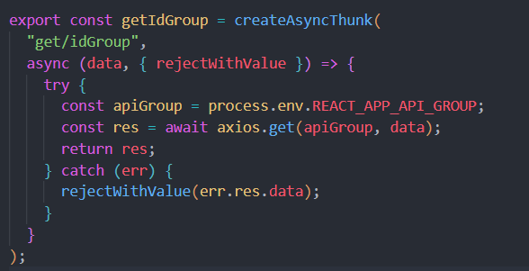
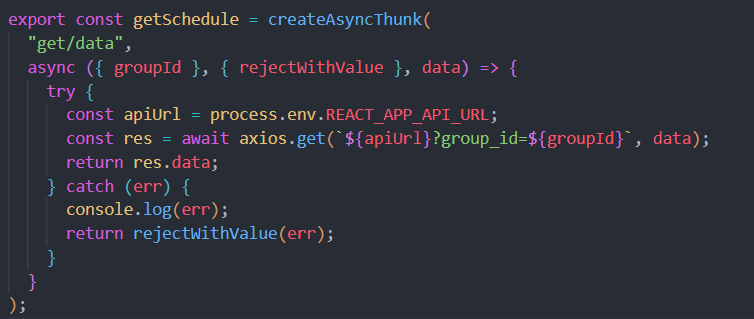

Руководство по использованию Расписание учебного заведения
Введение
Добро пожаловать в руководство по использованию Расписание учебного заведения. Это приложение предоставляет выбор интересующей группы и интерактивного просмотра расписания

Требования к окружению
Чтобы начать использовать Расписание учебного заведения, у вас должен быть установлен следующий минимальный набор программного обеспечения:

Браузер: Рекомендуется использовать последние версии браузеров Chrome, Firefox или Safari для оптимальной производительности.
Операционная система:  
Установка и настройка
Шаг 1: Загрузка исходного кода
Для начала, загрузите исходный код Расписание учебного заведения из https://github.com/KanaySeidi/schedule99. Вы можете воспользоваться следующей командой в командной строке:

bash
Copy code
git clone https://github.com/KanaySeidi/schedule99.git
Шаг 2: Установка зависимостей
Перейдите в каталог с загруженным исходным кодом и выполните следующую команду, чтобы установить все зависимости:

bash
Copy code
npm install
Шаг 3: Запуск приложения
Теперь, чтобы запустить Расписание учебного заведения, выполните следующую команду:

bash
Copy code
npm start
После выполнения этой команды, приложение будет доступно по адресу http://localhost:3000.

Основные функции
getIdGroup
Делает запрос на сервер чтобы получить все существующие группы и их id

Скриншот getIdGroup!

getSchedule
Делает запрос на сервер чтобы получить по id расписание этой группы

Скриншот getSchedule

...

Работа с интерфейсом
Навигация по приложению
Нас встречает заголовок с Названием продукта, дальше точное и актуальное время по Бишкеку, Кыргызстан (+6 GMT)
Выборка групп из выпадающего списка, далее мы выбираем интересующую группу и в отдельном окне отображаеться расписание.

Развитие и обновления
Мы регулярно обновляем Расписание учебного заведения, чтобы улучшить его функциональность и безопасность. Для получения новых версий и уведомлений о изменениях следите за нашими обновлениями на https://github.com/KanaySeidi/schedule99.git.

Поддержка и контактная информация
Если у вас возникли вопросы или проблемы, не стесняйтесь обращаться к нашей службе поддержки по адресу +996555853110.

Как я могу связаться с администрацией приложения?
Написать на почту kanayseidi@gmail.com

Завершение и благодарности
Спасибо, что выбрали Расписание учебного заведения! Мы надеемся, что это руководство поможет вам максимально эффективно использовать наше приложение. Если у вас есть предложения по улучшению или обратная связь, не стесняйтесь сообщить нам.
